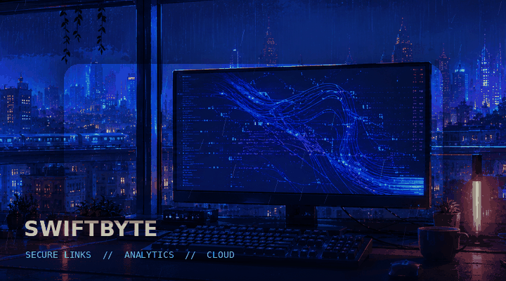
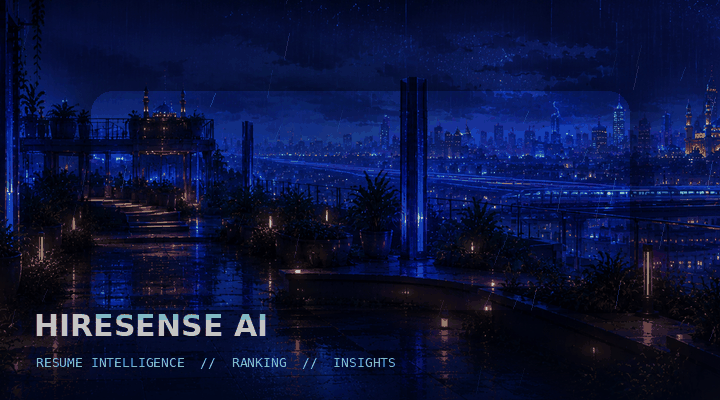

  

 

## About me

I'm Abhinay, a Computer Science undergraduate at KL University. I enjoy building full-stack applications and understanding how each part works—from the user interface and APIs to databases and deployment.

Most of what I know has come from building projects, breaking things, fixing them, and then improving them. Right now, I'm focusing on Java, DSA, backend development, and system-design fundamentals.

 

## Tech I work with

 

## Projects

<table>
<tr>
<td width="50%" valign="top">

### SwiftByte

A URL shortening and analytics platform with authentication, custom aliases, protected links, QR codes, Redis caching, and AWS deployment.

`React` `Node.js` `Express` `MongoDB`  
`Redis` `JWT` `AWS` `Nginx`

</td>
<td width="50%" valign="top">

### HireSense AI

A resume-screening platform that compares candidates with job descriptions, produces ATS scores, identifies missing skills, and ranks applicants.

`React` `Vite` `Node.js` `Express`  
`Gemini API` `PDF-Parse` `Vercel`

</td>
</tr>
</table>

 

## GitHub activity

 

## Contribution snake

<picture>
  <source media="(prefers-color-scheme: dark)" srcset="https://raw.githubusercontent.com/abhinaybhuvanesh/abhinaybhuvanesh/output/github-snake-dark.svg">
  <source media="(prefers-color-scheme: light)" srcset="https://raw.githubusercontent.com/abhinaybhuvanesh/abhinaybhuvanesh/output/github-snake.svg">
  
</picture>

 

<samp>Keep learning. Keep building.</samp>

