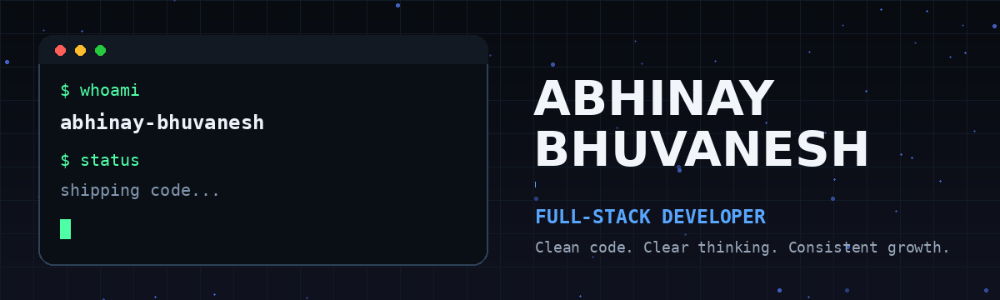
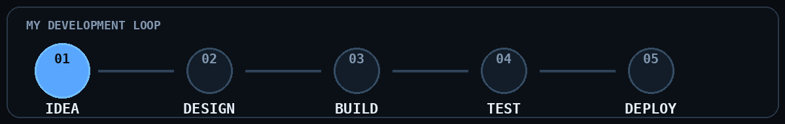

 

  
  
  

## About

Computer Science student and full-stack developer focused on building clean, useful, and production-ready applications. Currently strengthening Java, Data Structures and Algorithms, MERN development, backend engineering, and cloud deployment.

## Selected Work

<table>
<tr>
<td width="50%" valign="top">

### [SwiftByte](https://swiftbyte-url.vercel.app/)

Full-stack URL shortening platform with authentication, custom aliases, password-protected links, QR codes, analytics, Redis, AWS deployment, Nginx, and MongoDB.

`React` `Node.js` `Express` `MongoDB` `Redis` `AWS`

</td>
<td width="50%" valign="top">

### DevCollab

Real-time collaborative coding environment designed for multiple users, shared rooms, synchronized editing, and live execution workflows.

`React` `Node.js` `Socket.IO` `MongoDB`

</td>
</tr>
</table>

## Toolkit

  

## Activity

 

---

Build thoughtfully • Learn continuously • Ship consistently

