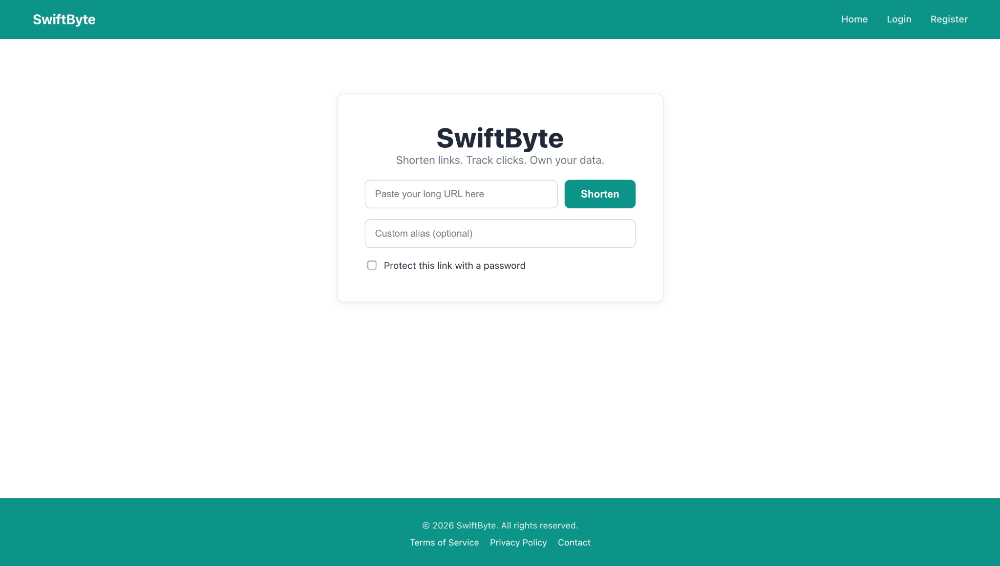
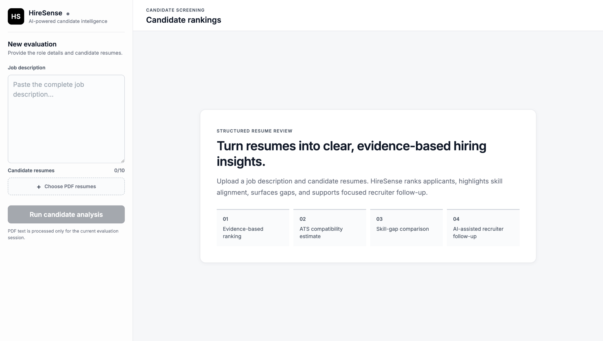

 

---

## About me

<table>
<tr>
<td width="58%" valign="middle">

Hi, I’m Abhinay — a Computer Science undergraduate at KL University.

I enjoy building full-stack applications and understanding how every part connects: the interface, APIs, authentication, databases, and deployment.

I built **SwiftByte** to learn secure backend development, authentication, analytics, and deployment. I built **HireSense AI** to explore how AI can help with resume screening and candidate ranking.

Currently focusing on **Java, DSA, backend development, and system-design fundamentals**.

</td>
<td width="42%" align="center" valign="middle">

</td>
</tr>
</table>

---

## Tech stack

---

## Featured projects

<table>
<tr>

<td width="50%" valign="top">

<h3 align="center">SwiftByte</h3>

A URL shortening and analytics platform with secure authentication, custom aliases, password-protected links, QR codes, and click analytics.

`React` `Node.js` `Express` `MongoDB`  
`JWT` `bcrypt` `QR Code` `Vercel`

</td>

<td width="50%" valign="top">

<h3 align="center">HireSense AI</h3>

An AI-powered resume screening platform that compares candidates with job descriptions, generates ATS scores, identifies skill gaps, and ranks applicants.

`React` `Vite` `Node.js` `Express`  
`Gemini API` `Multer` `PDF-Parse` `Vercel`

</td>

</tr>
</table>

---

## GitHub activity

 

